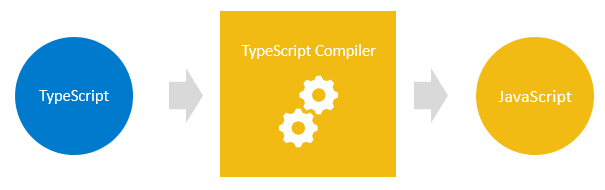
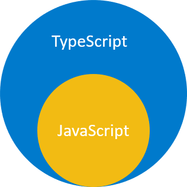

:::tip 前言
在本教程中，你会知道 TypeScript 是什么，以及对比原生的 JavaScript ，TypeScript 具备什么优势
:::

# TypeScript 介绍

TypeScript 是 JavaScript 的超集

TypeScript 建立在 JavaScript 之上。首先你编写 TypeScript 代码，然后使用 TypeScript 编译器把 TypeScript 代码编译成纯 JavaScript 代码来使用

一旦你有了这些纯 JavaScript 代码的时候，你可以把它们部署到任何 JavaScript 可以正常运行的环境

TypeScript 文件使用 `.ts` 作为扩展名，而 JavaScript 文件使用 `.js` 作为扩展名



TypeScript 在使用 JavaScript 的语法的基础上，添加了额外的语法来支持类型系统

如果你有一个没有任何语法错误的 JavaScript 的程序，那它也是一个 TypeScript 程序。这意味着所有的 JavaScript 程序，同时也是 TypeScript 程序。如果你需要把现存的 JavaScript 代码库改成 基于 TypeScript 的代码库，这将非常容易

下图展示了 TypeScript 和 JavaScript 之间的关系：



# 为什么选择 TypeScript

TypeScript 的主要目标有下面两个：

- 向 JavaScript 中引入可选类型系统
- 实现了未来 JavaScript 计划添加的特性，即与当前的 JavaScript 比较的 ECMAScript Next 或者 ES Next

## 1) TypeScript 帮助你避免很多的错误从而提升工作效率

类型系统帮助你避免很多的错误从而提升工作效率。使用类型系统的时候，你可以在编译时捕获错误，而不是到运行时才让这些问题显现出来

下面的函数将两个数字 x 和 y 相加：

```ts
function add(x, y) {
  return x + y;
}
```

如果你是通过 HTML 的 Input 元素获取到的值，并且把它们传入到这个函数，你可能会得到意料之外的结果：

```ts
const result = add(input1.value, input2.value);
console.log(result); // 结果是字符串连接
```

比如用户输入了 `10` 和 `20`， `add()` 函数会返回 `1020`，而不是 `30`

产生这样的原因是 `input1.value` 和 `input2.value` 都是字符串，而不是数字。当你使用操作符 `+` 将两个字符串相加的时候，操作符 `+` 会把两个字符串连接成一个单独的字符串

当你使用 TypeScript 显式指定参数的类型的时候，如下：

```ts
function add(x: number, y: number) {
  return x + y;
}
```

在这个函数里面我们给参数都添加了数字类型。`add()` 函数只会接受数字类型的参数值，不接受任何其他类型的参数值

当你如下调用函数的时候：

```ts
const result = add(input1.value, input2.value);
```

当你把 TypeScript 代码编译成 JavaScript 的时候，编译器会抛出一个错误。你可以进行修改，避免这个错误在运行时发生

## 2) TypeScript 把未来的 JavaScript 带到今天

TypeScript 为当前的 JavaScript 引擎中添加了 ES Next 中即将推出的新特性的支持。这意味着你可以在 Web 浏览器（或者其他环境）完全支持这些新的 JavaScript 特性之前先使用它们

每一年，TC39 都会为 ECMAScript(它是 JavaScript 的标准) 发布几个新特性，功能提案一般需要经历五个阶段：

- 第零阶段：最初的想法
- 第一阶段：提案
- 第二阶段：草稿
- 第三阶段：候选
- 第四阶段：完成

TypeScript 通常会支持还在第三阶段的特性

:::tip 译者留言
关于功能提案可以参考下面这篇文章
[ECMAScript - Introducing All Stages of the TC39 Process](https://nitayneeman.com/posts/introducing-all-stages-of-the-tc39-process-in-ecmascript/)
:::
