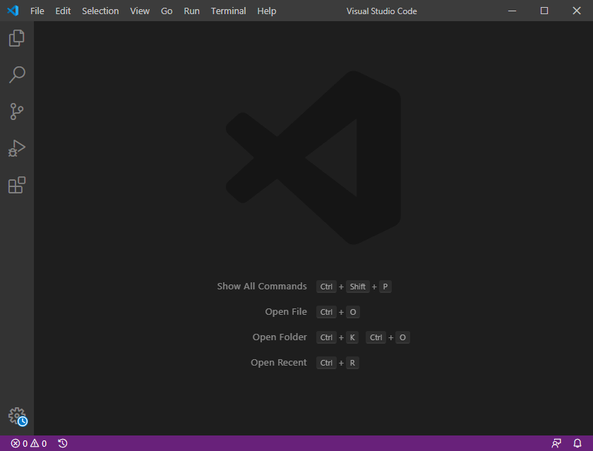
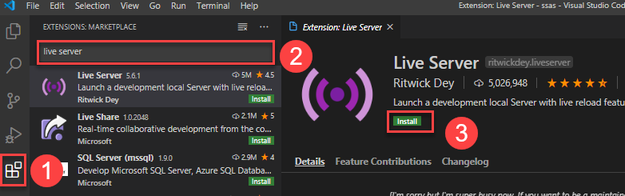

:::tip 前言
在本教程中，你会学习到如何搭建一个 TypeScript 开发环境
in this tutorial, you’ll learn how to set up a TypeScript development environment.
:::

你需要安装下面的工具来开始使用 TypeScript

- Node.js – Node.js is 是你运行 TypeScript 编译器的环境。注意你不需要了解 Node.js.
- TypeScript 编译器 – 一个把 TypeScript 编译成 JavaScript 代码的 Node.js 模块. 如果你在 Node.js 中使用 JavaScript，你可以安装 `ts-node` 模块，它是 Node.js 下的 TypeScript 执行引擎和交互式解释器
- Visual Studio Code 或者叫 VS code – 它是一个支持 TypeScript 开发的代码编辑器。非常推荐使用 VS Code。当然你可以使用你自己喜欢的编辑器

如果你是用 VS Code 你可以安装下面的插件来加速你的开发流程

- Live Server – 允许你启动本地开发服务器，使用热加载特性

# 安装 Node.js

你需要按照下面的步骤来安装 Node.js

- 前往 [Node.js 下载页面](https://nodejs.org/en/download/).
- 下载和你操作系统兼容的 Node.js 版本，比如 Windows, macOS 或者 Linux
- 执行下载下来的 Node.js 包或者可执行文件，安装非常简单
- 通过在 macOS 和 Linux 打开终端，或者在 Windows 上打开命令行工具，输入命令 `node -v`来验证安装是否成功。如果你看到的版本号就是你刚下载的，那么你已经成功在你的电脑上安装好了 Node.js

# 安装 TypeScript 编译器

安装 TypeScript 编译器，你需要在 macOS 或者 Linux 上启动终端，或者在 Windows 上启动命令行工具，然后输入以下命令：

```sh
npm install -g typescript
```

安装完以后，你可以敲入下面的命令来检查当前 TypeScript 编译器的版本：

```sh
tsc --v
```

它会返回版本号，如下：

```sh
Version 4.0.2
```

注意你的版本可能会比这个版本新

如果你是在 Windows 系统上得到下面的错误提示：

```sh
'tsc' is not recognized as an internal or external command,
operable program or batch file.
```

那么你需要把下面这个路径 `C:\Users\<user>\AppData\Roaming\npm` 添加到 `PATH` 变量中。注意你需要把路径中的 `<user>` 换成你自己 Windows 系统上的用户名

你可以在 macOS 和 Linux 的终端或者 Windows 的命令行工具，运行下面的命令来全局安装 `ts-node` 模块

```sh
npm install -g ts-node
```

# 安装 VS Code

你可以按照下面的步骤来安装 VS Code

- 前往 [VS Code 下载页面](https://code.visualstudio.com/download)
- 下载最新切和你操作系统(Windows, macOS, 或者 Linux)兼容的 VS Code 版本
- 执行下载好的安装包或者安装程序文件来启动安装向导，安装过程也非常简单
- 启动 VS Code.

你会看到如下所示的 VS Code 工具



你可以按照下面的步骤来安装 Live Server 扩展



- 点击扩展选项卡来找到 VS Code 的扩展列表
- 输入 live server 来查找 Live Server 扩展
- 点击 `install` 安装来安装这个扩展

在这个教程，你学习了如果搭建用于 TypeScript 使用的开发环境
