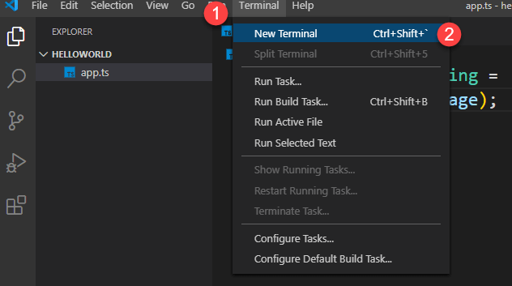
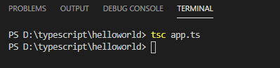
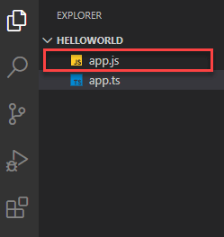
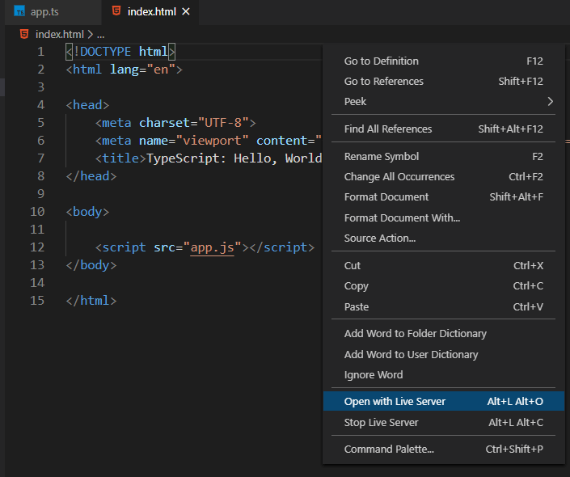
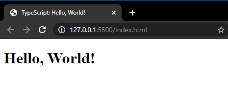

:::tip 前言
在本教程中，你会学习到在 TypeScript 如何开发一个 Hello World 程序
:::

## Node.js 下的 TypeScript Hello World 程序

第一，创建一个文件夹来存放我们的代码，比如 `helloword`

第二，启动 VS Code 并且打开上面的文件夹

第三，来创建一个新的 TypeScript 文件，命令为 `app.ts`。TypeScript 文件的扩展名是 `.ts`

第四，我们在 `app.ts` 文件中输入下面的源代码

```ts
const message: string = 'Hello, World!';
console.log(message);
```

第五，通过使用键盘快捷键 `Ctrl+` 或者使用菜单 `Terminal > New Terminal`，在 VS Code 中启动一个新的终端



第六，在终端输入下面的命令来编译 `app.ts` 文件：

```sh
tsc app.ts
```



如果一切正常，你会看到 TypeScript 编译器生成了一个命名为 `app.js` 的新文件



你可以使用下面的命令在 Node.js 端执行 `app.js` 文件

```sh
node app.js
```

如果你已经安装了在 [搭建 TypeScript 开发环境](/1-getting-started/2-setup-typescript/) 提到的 `ts-node`模块，你可以只使用一个命令来编译 TypeScript 文件，并同时执行输出的文件

```sh
ts-node app.ts
```

## Web 浏览器下的 TypeScript Hello World 程序

按照下面的步骤来创建一个网页，它会在 Web 浏览器中显示 `Hello, World!` 信息

首先, 创建一个命名为 `index.html` 的文件，文件中包含了 `app.js` ，如下：

```html
<!DOCTYPE html>
<html lang="en">
  <head>
    <meta charset="UTF-8" />
    <meta name="viewport" content="width=device-width, initial-scale=1.0" />
    <title>TypeScript: Hello, World!</title>
  </head>
  <body>
    <script src="app.js"></script>
  </body>
</html>
```

第二，把 `app.js` 文件改成如下所示代码

```ts
const message: string = 'Hello, World!';
// 创建一个新的 H1 头部元素
const heading = document.createElement('h1');
heading.textContent = message;
// 把头部元素添加到文档中
document.body.appendChild(heading);
```

第三，编译 `app.ts` 文件

```sh
tsc app.ts
```

第四，在 VS Code 中鼠标右键单击 `index.html` 文件，然后选择 `Open with Live Server` 选项来打开 Live Server 服务



Live Server 会打开 `index.html` ，并显示下面的信息



需要改变显示信息的话，你需要编辑 `app.ts` 文件，比如：

```ts
const message: string = 'Hello, TypeScript!';

const heading = document.createElement('h1');
heading.textContent = message;

document.body.appendChild(heading);
```

然后编译 `app.ts` 文件

```sh
tsc app.ts
```

TypeScript 编译器会生成新的 `app.js` 文件，然后 Live Server 会在 Web 浏览器中自动重新加载新的 `app.js` 文件

注意 `app.js` 文件是 `app.ts` 文件的输出文件，你不应该直接修改 `app.js` 里面的代码，否则你在重新编译 `app.ts` 文件的时候，你会丢失之前更改操作

在本教程中，你学习了如果创建第一个名为 `Hello, World!` 的 TypeScript 程序，它可以在 Node.js 和 Web 浏览器中正常工作
