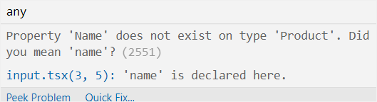

:::tip 前言
在本教程中，你将会了解到为什么要用 TypeScript 替代 JavaScript，来避免动态类型引发的一些问题
:::

# 为什么使用 TypeScript

这里有两个原因去使用 TypeScript：

- TypeScript 增加了类型系统来帮助你避免 JavaScript 中由于动态类型而引发的许多问题
- TypeScript 实现了很多 JavaScript 的未来特性，也就是 [ES Next](https://zh.javascript.info/)，所以我们可以在今天使用这些特性.

这个教程会聚焦在第一个原因上

# 理解 JavaScript 中的动态类型

JavaScript 是动态类型的。与其他比如 `Java` 或者 `C#` 这些静态语言不同，值具有类型而不是变量，比如：

```ts
"Hello";
```

对于这个值，你可以说它的类型是 `string`，又比如下面的值是一个数字：

```ts
2020;
```

看看下面的例子：

```ts
let box;
box = "hello";
box = 100;
```

`box` 变量的类型随着赋值给它的值的类型改变而改变

你可以在运行的时候使用 `typeof` 操作符来找出 `box` 变量的类型

```ts
let box;
console.log(typeof box); // undefined

box = "Hello";
console.log(typeof box); // string

box = 100;
console.log(typeof box); // number
```

在这个例子中，第一条语句定义了一个变量但是没有进行赋值，所以它的类型是 `undefined`

接下来，我们将 `"Hello"` 赋值给 `box` 变量并打印它的类型，这个时候 `box` 变量的类型变成了 `string`

最后，我们将 `100` 赋值给 `box` 变量，这个时候，`box` 变量的类型变成了 `number`

正如你所见的，每当变量被赋值的时候，它的类型将会变化

并且你不需要显式地告诉 JavaScript 变量的类型是什么，JavaScript 会自动根据值来推断它的类型

动态类型提供了灵活性，但是，它也引发了一些问题

## 动态类型的问题

假设你有一个方法，它会根据 id 返回一个 `product` 对象

```ts
function getProduct(id) {
  return {
    id: id,
    name: `Awesome Gadget ${id}`,
    price: 99.5,
  };
}
```

下面的例子调用 `getProduct()` 函数检索 id 等于 1 的产品，并显示它的数据：

```ts
const product = getProduct(1);
console.log(`The product ${product.Name} costs $${product.price}`);
```

输出：

```sh
The product undefined costs $99.5
```

但是和我们所期望的结果并不一致

这段代码的问题是 `product` 对象没有 `Name` 属性，它只有首字母为小写 `n` 的 `name` 属性

然后，你只有在你运行这段脚本的时候才会发现这个问题

引用对象上不存在的属性是编写 JavaScript 代码工作中常见的问题

下面的例子定义了一个新的函数，它会在控制台中输出产品的信息：

```ts
const showProduct = (name, price) => {
  console.log(`The product ${name} costs ${price}$.`);
};
```

下面的例子调用 `getProduct()` 和 `showProduct()` 函数：

```ts
const product = getProduct(1);
showProduct(product.price, product.name);
```

输出：

```sh
The product 99.5 costs $Awesome Gadget 1
```

这一次我们以错误的顺序传递参数给 `showProduct()` 函数。这是你在使用 JavaScript 的时候常见的另外一个问题

这就是 TypeScript 发挥作用的原因

# Typescript 是如何解决动态类型引发的问题

为了解决引用对象上不存在的属性的问题，你可以按照下面的步骤来进行：

首先，我们使用 [接口](/6-interfaces/1-interface/) 来定义 `product` 对象的 "形状"，注意你会在接下来的教程中 [学习关于接口的知识]()

```ts
interface Product {
  id: number;
  name: string;
  price: number;
}
```

然后，显式地使用 `Product` 类型作为 `getProduct()` 函数的返回类型：

```ts
function getProduct(id): Product {
  return {
    id: id,
    name: `Awesome Gadget ${id}`,
    price: 99.5,
  };
}
```

当你引用一个不存在的属性的时候，代码编辑器会马上通知你:

```ts
const product = getProduct(1);
console.log(`The product ${product.Name} costs $${product.price}`);
```

代码编辑器会在 `Name` 属性上高亮显式下面的问题：


当你把鼠标悬停在这个错误上面的时候，你会看到一个如何解决这个问题的提示：



为了解决以错误的顺序传递参数的问题，你可以显式地给函数的参数定义类型：

```ts
const showProduct = (name: string, price: number) => {
  console.log(`The product ${name} costs ${price}$.`);
};
```

那么当你传递了错误类型的参数给 `showProduct()` 函数的时候，你会收到一个错误：

```ts
const product = getProduct(1);
showProduct(product.price, product.name);
```


# 总结

- JavaScript 是一门动态类型语言，它提供了灵活性但是引发了很多问题
- TypeScript 在 JavaScript 基础上增加了可选类型系统来解决这些问题
