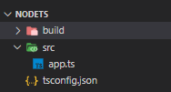
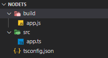

:::tip 前言
在本教程中，你将学习如何搭建 Node.js 项目中的 TypeScript 自动化开发工作流
:::

:::tip
本教程假设你在你的系统上已经安装 Node.js 和 tsc 模块
:::

# 创建项目结构

首先我们创建一个新的目录 `nodets`.

接下来，在 `nodets` 目录下面创建两个子目录，分别是 `build` 和 `src`，如下所示：


你的 TypeScript 代码存储在 `src` 目录下

当 TypeScript 编译器编译了 TypeScript 源文件的时候，它会把输出文件存储在 `build` 目录中

# 配置 TypeScript 编译器

在 macOS 和 Linux 的终端或者 Windows 上的命令提示符中，在 `nodets` 目录下运行下面的命令来创建 `tsconfig.json` 文件

```sh
tsc --init
```

你会看到 `nodets` 目录下 `tsconfig.json` 被创建了


`tsconfig.json` 文件指定目录 (`nodets`) 是 TypeScript 项目的根目录

当你编译 TypeScript 文件的时候，TypeScript 编译器会使用 `tsconfig.json` 中的选项来编译项目

现在，你可以打开 `tsconfig.json` 文件，里面有非常多的选项，在本教程中，主要关注两个选项：

- `rootdir` – 指定 TypeScript 输入文件的根目录
- `outdir` - 存储 JavaScript 输出文件的目录

这些选项在默认情况下是被注释掉的，你需要取消它们的注释（删除行首的 `//`），并改成下面这样：

对于 `outDir` 选项：

```TypeScript
"outDir": "./build"
```

而对于 `rootDir` 选项：

```TypeScript
"rootDir": "./src"
```

为了验证新的配置是否正确，你可以在 `./src` 目录下创建一个名为 `app.ts` 的新文件，并敲入以下代码：

```TypeScript
console.log('Node.js TypeScript');
```



接下来运行下面的命令来执行 TypeScript 编译器，它会编译所有存储在 `src` 目录下的文件：

```sh
tsc
```

如果配置是正确的，你将会看到 `./build` 目录下生成了 `app.js` 文件



导航到 `build` 目录并执行下面的命令来运行 `app.js` 文件：

```sh
node app.js
```

你会看到下面的输出：

```sh
Node.js TypeScript
```

每当你修改了 TypeScript 代码的时候，你需要：

- 构建项目
- 运行 JavaScript 输出文件

这样很浪费时间

幸运的是，你可以使用一些 Node.js 模块使整个流程自动化

# 安装 Node.js 模块

`nodemon` 模块允许你在更改了 JavaScript 源代码的时候，自动重新启动应用程序

`concurrently` 模块允许并发运行多个命令

首先在根目录下执行 `npm init` 命令：

```sh
npm init --yes
```

接下来，安装 `nodemon` 和 `concurrently` 模块：

```sh
npm install --g nodemon concurrently
```

它需要话费一定的时间去安装，当安装完成我们可以继续下面的步骤

注意 `--g` 标识指示 npm 全局安装这两个模块，它允许你在其他项目中使用它们

接下来，打开 `package.json` 文件，你在 `scripts` 选项中会看到下面的代码：

```json
...
"scripts": {
    "test": "echo \"Error: no test specified\" && exit 1"
},
...
```

接下来，把 `scripts` 修改成下面这样：

```json
...
"scripts": {
    "start:build": "tsc -w",
    "start:run": "nodemon build/app.js",
    "start": "concurrently npm:start:*"
},
...
```

`"start:build": "tsc -w"` 会监听 `./src` 下的文件变化，发生变化的时候自动重新编译它们

`"start:run": "nodemon build/app.js"` 每当新文件产生的时候，自动运行 `./build` 目录下的 `app.js` 文件

`"start": "concurrently npm:start:*"` 运行所有 `npm:start:*` 开头的命令，它会执行上面的 `start:build` 和 `start:run` 命令

因为 `app.js` 会是 Node.js 程序的入口点，你还需要把 `package.json` 文件中下面的选项修改成 `app.js`

从：

```TypeScript
"main": "index.js"
```

修改成：

```TypeScript
 "main": "app.js"
```

最后，运行下面的命令：

```sh
npm start
```

为了验证配置的正确性，你可以修改一些 `app.ts` 中的代码，然后你将会在控制台看到一些输出
