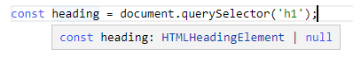
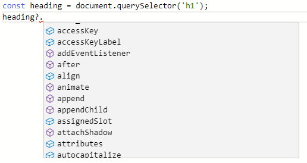
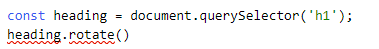

:::tip 前言
在本教程中，你将了解 TypeScript 的类型以及它的用途。
:::

## TypeScript 中的类型是什么

在 TypeScript 中，类型可以方便地描述出一个值拥有的属性和方法，值是你可以赋值给变量的任何东西，比如数字，字符串，数组，对象或者函数。

看看下面的值：

```ts
'Hello';
```

当你看这个值的时候，你可以说它是一个字符串，这个值拥有字符串拥有的属性和方法。

例如，`'Hello'` 有一个 `length` 属性，可以返回它拥有的字符数量：

```ts
console.log('Hello'.length); // 5
```

它也有很多的方法，比如 `match()`， `indexOf()` 和 `toLocaleUpperCase()`，如下所示：

```ts
console.log('Hello'.toLocaleUpperCase()); // HELLO
```

通过列出它的属性和方法来描述它的话，将是非常不便的。

通过类型来描述一个值是一个更加简洁的方式，在这个例子中，你说 `'Hello'` 是一个字符串，然后你知道你可以在 `'Hello'` 值上使用字符串拥有的属性和方法。

总之，在 TypeScript 中：

- 类型是描述值所具有的不同属性和方法的标签
- 每个值都有一种类型

## TypeScript 中的类型

TypeScript 继承了 JavaScript 的内置类型，TypeScript 的类型氛围：

- 基本类型
- 对象类型

### 基本类型

下面举例说明 TypeScript 中的基本类型：

| 名字                                    | 描述                                        |
| --------------------------------------- | ------------------------------------------- |
| [字符串类型](/2-basic-types/3-string/)  | 表示文本类型数据                            |
| [数字类型](/2-basic-types/2-number/)    | 表示数值                                    |
| [布尔值类型](/2-basic-types/4-boolean/) | 有真值和假值                                |
| null                                    | 有一个值：null                              |
| undefined                               | 有一个值：undefined，它是未出话变量的默认值 |
| symbol                                  | 表示唯一的常量值                            |

### 对象类型

对象类型包括函数，数组和类等，稍后你将学习如何创建自定义对象类型。

## TypeScript 中类型的作用

TypeScript 中类型的两个主要目的如下：

- 熟悉，TypeScript 编辑器使用类型来分析错误代码；
- 其次，类型帮助你了解变量相关联的值是什么

## TypeScript 类型示例

下面的例子使用 [querySelector()](https://zh.javascript.info/searching-elements-dom#querySelector) 方法来选出 `<h1>` 元素：

```ts
const heading = document.querySelector('h1');
```

TypeScript 编辑器知道 `heading` 的类型是 `HTMLHeadingElement`：



它显示了 类型为 `HTMLHeadingElement` 的 `heading` 变量可以访问的属性和方法列表：



如果你试图访问它没有的属性或者方法，TypeScript 编译器会显示错误提示，如下所示：



## 总结

- TypeScript 中每个值都有一个类型；
- 类型是描述值所具有的属性和方法的标签；
- TypeScript 编译器使用类型来分析你代码，从而找出存在的 bug 或者错误。
