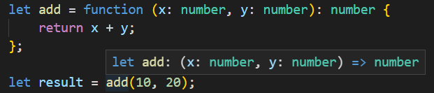

:::tip 前言
在本教程中，你将学习 TypeScript 中的函数类型，它允许你为函数定义类型
:::

# TypeScript 中的函数类型介绍

一个函数类型由两个部分组成：参数和返回类型，当声明一个函数类型时，你需要用下面的语法来指定这两个部分：

```ts
(parameter: type, parameter: type, ...) => type
```

下面的例子演示了如何声明一个变量，它是一个接受两个数字类型的参数和返回一个数字的函数类型

```ts
let add: (x: number, y: number) => number;
```

在这个例子中：

- 函数类型接受两个参数：`x` 和 `y`，他们都是 `number` 类型
- 返回值的类型是 [数字类型](/2-basic-types/2-number/) ，它跟在参数和返回类型之间的胖箭头 (`=>`) 后面

::: tip
注意，参数的命名 (`x` 和 `y`) 指示为了方便阅读，只要参数的类型匹配，它就是函数中有效的类型
:::

当给一个变量注释函数类型后，你可以把有相同类型的函数赋值给这个变量

TypeScript 编译器会检查参数的数量和类型以及返回类型是否匹配

下面的例子展示如何把一个函数赋值给 `add` 变量

```ts
add = function (x: number, y: number) {
  return x + y;
};
```

同样的，你也可以像这样声明一个变量并把函数赋值给它：

```ts
let add: (a: number, b: number) => number = function (x: number, y: number) {
  return x + y;
};
```

如果你赋值了另外一个类型与 `add` 变量不匹配的函数，TypeScript 会抛出错误：

```ts
add = function (x: string, y: string): number {
  return x.concat(y).length;
};
```

在这个例子中，我们将一个类型不匹配的函数重新赋值给 `add` 函数

# 推断函数类型

当在等式的一边有类型的时候，TypeScript 编译器可以推断出函数的类型，这种形式的 [类型推断](/2-basic-types/15-type-inference/) 被称为上下文类型，比如：



在这个例子中，`add` 函数会得到 `(x: number, y:number) => number` 这种类型

通过使用类型推断，你可以显著的通过减少注释来减少代码数量
