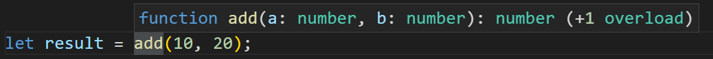

:::tip 前言
在本教程中，你将学习 TypeScript 中的函数重载
:::

# TypeScript 中的函数重载介绍

在 TypeScript 中，函数重载允许你建立函数的参数类型和返回类型之间的关系

::: tip
注意 TypeScript 的函数重载不同于其他静态类型语言，比如 `C#` 和 `Java` 支持的函数重载
:::

让我们看几个简单的例子：

```ts
function addNumbers(a: number, b: number): number {
  return a + b;
}

function addStrings(a: string, b: string): string {
  return a + b;
}
```

在这个例子中：

- `addNumbers()` 函数返回两数之和
- `addStrings()` 函数返回两个字符串连接

可以使用 [联合类型](/2-basic-types/12-union-type/) 来定义一个函数参数和返回值的类型范围：

```ts
function add(a: number | string, b: number | string): number | string {
  if (typeof a === 'number' && typeof b === 'number') {
    return a + b;
  }

  if (typeof a === 'string' && typeof b === 'string') {
    return a + b;
  }
}
```

然后，联合类型不能精确地表示参数类型和返回值类型之间的关系

`add()` 函数告诉编译器它将接受数字或者字符串参数，返回一个数字或者字符串。但是它无法描述在参数都为数字的时候，返回数字，当参数都是字符串的时候返回字符串

为了更好地描述函数使用的类型之间的关系，TypeScript 支持函数重载，比如：

```ts
function add(a: number, b: number): number;
function add(a: string, b: string): string;
function add(a: any, b: any): any {
  return a + b;
}
```

在这个例子中，我们向 `add()` 函数添加了两个重载，第一个重载告诉编译器参数都是数字时，`add()` 函数应该返回一个数字。第二个重载执行相同的操作，不过换成了针对字符串类型的参数

每个函数重载定义了 `add()` 函数支持的类型组合，描述了参数和它返回值类型之间的映射关系

现在当你调用 `add()` 函数，代码编辑器会提示有一个可用的重载函数，如下图所示：



# 数函数重载中使用可选参

当你使用函数重载的时候，函数所需的参数数量必须相同，如果又一个函数重载比另外一个重载的参数多的话，你必须把其他参数设置成可选的，比如：

```ts
function sum(a: number, b: number): number;
function sum(a: number, b: number, c: number): number;
function sum(a: number, b: number, c?: number): number {
  if (c) return a + b + c;
  return a + b;
}
```

`sum()` 函数接受两个或者三个数字，第三个参数是可选的，如果你没有把它设置为可选，你将会得到一个错误提示

# 方法重载

当一个函数是一个类的属性的时候，它被称为方法，TypeScript 也支持方法重载，比如：

```ts
class Counter {
  private current: number = 0;
  count(): number;
  count(target: number): number[];
  count(target?: number): number | number[] {
    if (target) {
      let values = [];
      for (let start = this.current; start <= target; start++) {
        values.push(start);
      }
      this.current = target;
      return values;
    }
    return ++this.current;
  }
}
```

`count()` 函数可以返回一个数字或者一个数组，取决于你传递给它的参数的数量

```ts
let counter = new Counter();

console.log(counter.count()); // return a number
console.log(counter.count(20)); // return an array
```

输出：

```sh
1
[
   1,  2,  3,  4,  5,  6,  7,
   8,  9, 10, 11, 12, 13, 14,
  15, 16, 17, 18, 19, 20
]
```

# 小结

- TypeScript 中的函数重载允许你描述函数的参数类型和返回类型之间的关系
